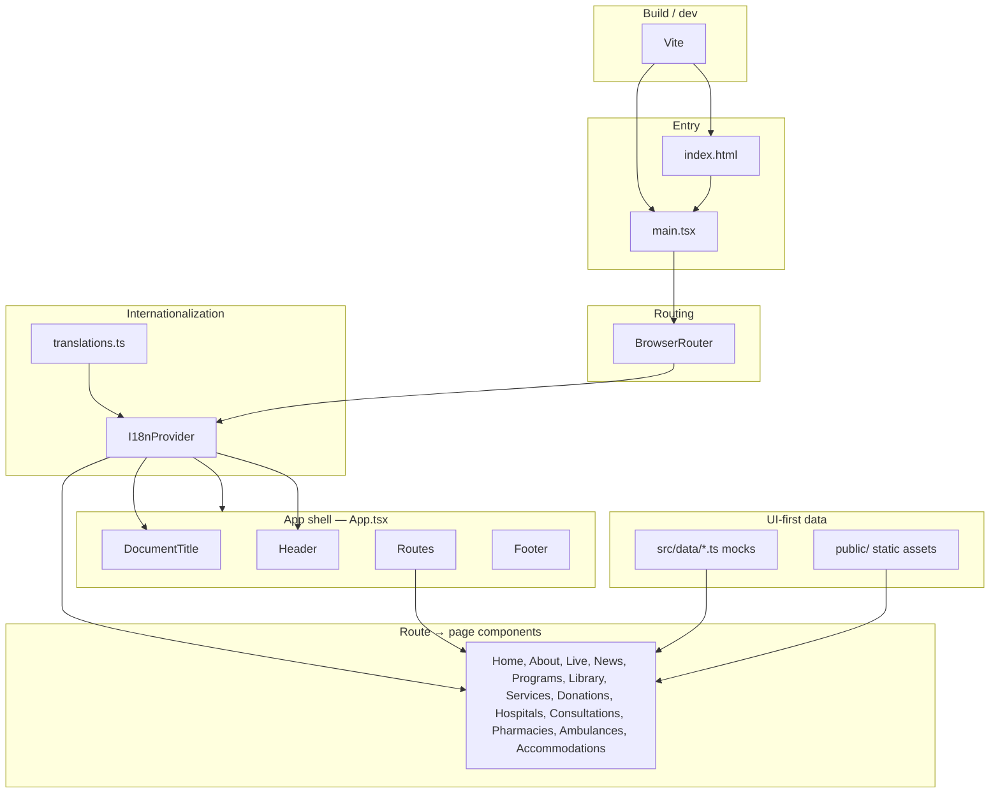

# MACHAFI frontend — block diagram

Versioned overview of the **`frontend/`** app (Vite + React + React Router + Tailwind). For an interactive DAG, open **`canvases/frontend-block-diagram.canvas.tsx`** in Cursor Canvas preview.

## Runtime stack (top → bottom)

## Concise layer view

| Layer | Responsibility |
| --- | --- |
| **Vite** | Dev server, production bundle, copies `public/`. |
| **Entry** | Mount React root, import global CSS. |
| **Router** | URL → page component. |
| **I18n** | `language`, `dir`, `t()`; syncs `document.documentElement`. |
| **Shell** | Fixed header, scrollable main, footer; `DocumentTitle` sets tab title. |
| **Pages** | Feature UI; consume `t()` + mock data; no network layer yet. |
| **Data** | Typed mocks per domain; replace with `services/` + API later. |

## Future boundary (planned)

---

_Changelog: 2026-04-29 — initial diagram for current frontend._

---

*Last updated: **2026-05-14** — Gateway + TV branding (Machafi TV logo in shell and gateway strip), Services masthead mint/grid, `frontend/public/branding/`, Vercel https://kgcmachafi.vercel.app ; doc sync.*
